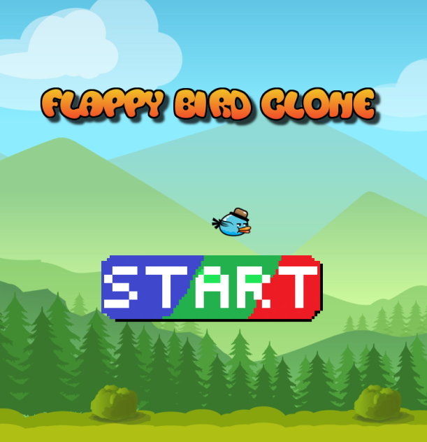

# Flappy Bird Clone

**Flappy Bird Clone** is a flappy bird clone made in Processing 3.3.6. Flappy Bird was originally created by Dong Nguyen in 2013.

I made this game as an attempt to rekindle the joy of programming in my heart. I only succeeded in making the game.

## Acknowledgements

This section explains where each asset used in the project came from. For more details on the credits, please see the comment section of [Flappy_Bird_Clone.pde](Flappy_Bird_Clone.pde).

### Images

The [background image](Images/background.png) of the game is a royalty-free image [here](https://www.shutterstock.com/image-vector/forest-game-background-2d-application-vector-443879794).

All images in the folder [Bird](Images/Bird) are free Art Assets from bevouliin.com at [here](https://opengameart.org/content/free-game-asset-grumpy-flappy-bird-sprite-sheets).

The [title](Images/title.png), the images in [Button](Images/Button), and the images in [Pipe](Images/Pipe) were all made by the author either using pixel art or external tools.

### Sound Effect

All sound effects used in this project are royalty-free music from [pixabay.com](pixabay.com).

